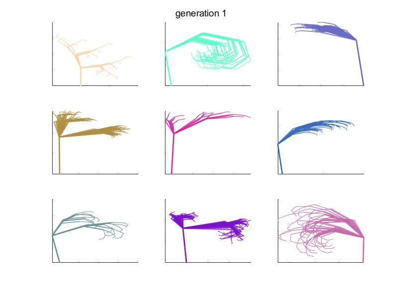

# Biomorphs

Link to FileExchange:

This is an evolutionary algorithm that allows the user to select shapes to generate a desired desing.
The purpose of the code is to learn the main concepts behind evolutionary algorithms while playing around with beatiful and intricate shapes.

It is vaguely inspired in the concept of **Biomorphs**, a virtual creature described by Richard Dawkins in his book _The Blind Watchmaker_. The so-called **Biomorphs** are a collection of lines drawn by a simple set of instructions. Here, I restrict myself to the rules for generating fractal trees.

The code is written by me on Matlab with the exception of the function for fractal generation, which is modified from: Dmitry (2021). Generation of 2D fractal trees (https://www.mathworks.com/matlabcentral/fileexchange/29536-generation-of-2d-fractal-trees), MATLAB Central File Exchange. Retrieved April 19, 2021.

Variables:
-------------------
